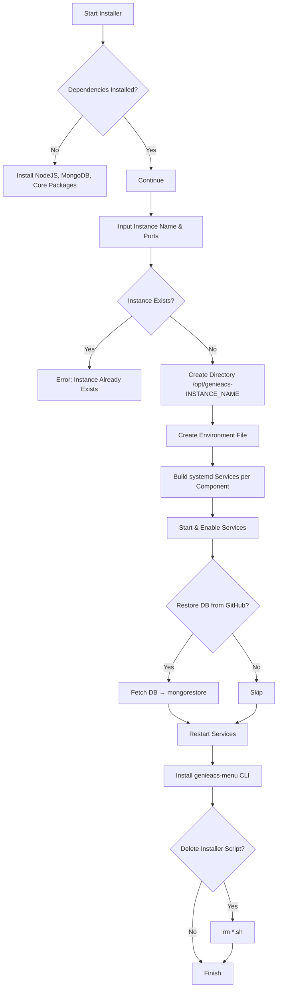
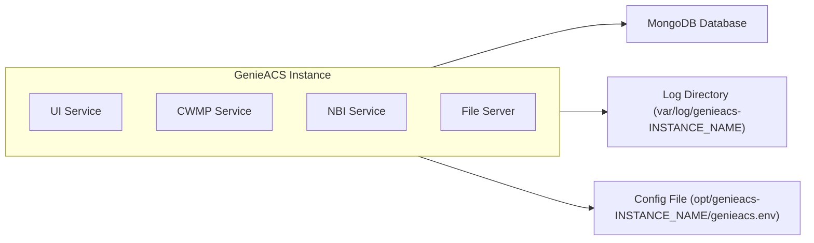

<p align="center">
  
</p>

<h1 align="center">🚀 Installer GenieACS — NATVPS / Multi Instance / Auto Restore DB</h1>

<p align="center">
  <b>Full Installer • Multi Client Support • Auto Recovery DB • Menu CLI</b>
</p>

<p align="center">
  <!-- Shields / Badges -->
  
  
  
  
  
</p>

---

# 🎥 Demo Video

> Klik untuk melihat proses instalasi lengkap

[](https://www.youtube.com/watch?v=9h2hS8cYb2k)

---

# 📦 Installer Tersedia

### **🟢 Installer 1 — Single Instance**

Instalasi default GenieACS (UI port 3000)

```bash
wget https://raw.githubusercontent.com/heruhendri/Installer-GenieACS/main/install-genieacs.sh
chmod +x install-genieacs.sh
./install-genieacs.sh
````

---

### **🔵 Installer 2 — Multi Instance (client1, client2, dst.)**

Mendukung banyak client pada satu server (isolasi penuh)

```bash
wget https://raw.githubusercontent.com/heruhendri/Installer-GenieACS/tambah-menu/installer-multi-genieacs.sh
chmod +x installer-multi-genieacs.sh
./installer-multi-genieacs.sh
```

---

# 🧩 Perbedaan Installer

| Fitur                       | Installer 1 | Installer 2 |
| --------------------------- | ----------- | ----------- |
| Single Instance             | ✅           | ❌           |
| Multi Instance              | ❌           | ✅           |
| Database Per Instance       | ❌           | ✅           |
| Port Unik Per Client        | ❌           | ✅           |
| Auto Restore DB dari GitHub | ❌           | ✅           |
| Menu CLI `genieacs-menu`    | ❌           | ✅           |
| NATVPS Support              | ⚠️          | ✅           |
| Auto Service Builder        | ⚠️          | ✅           |

---

# 🧱 Struktur Folder Multi Instance

```
/opt/genieacs-<instance>/
│── genieacs.env
│── ext/
/var/log/genieacs-<instance>/
│── ui.log, fs.log, nbi.log, cwmp.log
MongoDB:
  genieacs-<instance>
Service:
  genieacs-<instance>-ui
  genieacs-<instance>-nbi
  genieacs-<instance>-fs
  genieacs-<instance>-cwmp
```

---

# 🔧 Port Default

| Port | Fungsi      |
| ---- | ----------- |
| 3000 | GenieACS UI |
| 7547 | CWMP        |
| 7557 | NBI         |
| 7567 | File Server |

---

# 🧭 Instalasi Multi Instance



---

# 🏗 Arsitektur Sistem GenieACS



---

# 🛠 Menu CLI — `genieacs-menu`

Setelah instalasi, cukup jalankan:

```
genieacs-menu
```

Menu meliputi:

* Start/Stop/Restart Semua Service
* Reset Database (Auto download DB default dari GitHub)
* Ganti Port Instance
* Cek Log Realtime
* Backup Database
* Tambah Instance Baru

---

# 🗃 Restore Database Default

Installer otomatis mengambil DB preset dari:

```
https://github.com/heruhendri/Installer-GenieACS/tree/tambah-menu/db
```

Perintah manual:

```bash
genieacs-menu → Reset Database
```

---

# 🗑 Uninstall Semua Instance

```bash
systemctl stop genieacs-* 
systemctl disable genieacs-*
rm -rf /opt/genieacs*
rm -rf /var/log/genieacs*
rm /etc/systemd/system/genieacs-*.service
systemctl daemon-reload
```

---

# 📜 Changelog

## **v2.5 — 2025**

* Menambahkan auto-restore DB via GitHub
* Menu CLI lengkap (`genieacs-menu`)
* Auto service builder
* Support total multi instance tanpa batas
* Perbaikan struktur folder
* Perbaikan auto-start service setelah reset DB
* Compatible NATVPS

## **v2.1 — 2024**

* Multi instance awal
* Port custom
* Database per instance

## **v1.0 — 2023**

* Installer single instance

---

# 📄 License

MIT License (free to use & modify)

---

# 💬 Support

Telegram: **@GbtTapiPngnSndiri**

---

<p align="center">
  ⭐ Jika project ini membantu, silakan beri bintang di GitHub!
</p>

